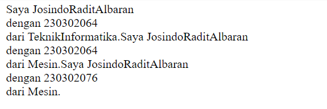
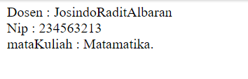
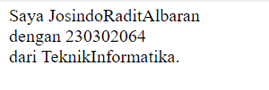
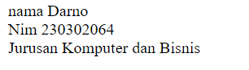
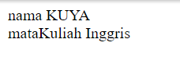
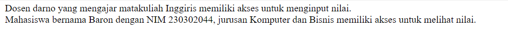
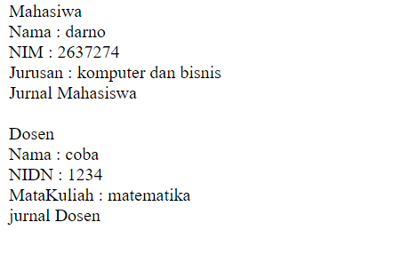

# PWEB2
### Pertemuan 1-2

## <center>JOBSHEET 1</center>
## #Instruksi Kerja
``` php
<?php
//menambahakan Atribut dan Metode
class Mahasiswa {
    public $nama;
    public $nim;
    public $jurusan;

    public function __construct($nama, $nim, $jurusan) {
        $this->nama = $nama;
        $this->nim = $nim;
        $this->jurusan = $jurusan;


    }
    // function tampilData
    public function tampilakanData() {
        return "Saya $this->nama, dengan $this->nim, dari $this->jurusan.";

    }

    // function untuk mengupdate Jurusan
    public function updateJurusan($newJurusan) {
        $this->jurusan = $newJurusan;
    }
    // function untuk setting nim
    public function setNim($newNim){
        $this->nim = $newNim;
    }


}
// Menampilkan data
$mahasiswa1 = new mahasiswa("JosindoRaditAlbaran", "230302064", "TeknikInformatika");
echo $mahasiswa1->tampilakanData();
echo $mahasiswa1->updateJurusan("Mesin");
echo $mahasiswa1->tampilakanData();
echo $mahasiswa1->setNim("230302076");
echo $mahasiswa1->tampilakanData();
?>
```
## 1. Membuat Class Mahasiswa
Membuat class mahasiswa, memiliki atribut yang berisi Nama, NIM, Jurusan.

```php
//menambahakan Atribut dan Metode
class Mahasiswa {
    public $nama;
    public $nim;
    public $jurusan;
}
```
## 2. Penggunaan method constractor

Membuat Method constructor yang digunakan untuk menganalisis data atribut pada claas dosen.
```php
public function __construct($nama, $nim, $jurusan) {
        $this->nama = $nama;
        $this->nim = $nim;
        $this->jurusan = $jurusan;
}
```

## 3. Penggunaan method TampilData
Membuat Method tampilkanDosen yang digunakan untuk menampilkan Atribut atau isi Atribut pada class dosen.
```php
public function tampilakanData() {
        return "Saya $this->nama, dengan $this->nim, dari $this->jurusan.";
}
```
## 4. Penggunaan method updateJurusan

Mengubah value dari jurusan pada atrubut dalam class mahasiswa
```php
public function updateJurusan($newJurusan) {
        $this->jurusan = $newJurusan;
    }
```
## 5. penggunaan method setNim
digunakan untuk mwngisi nim pada atribut
```php
public function setNim($newNim){
        $this->nim = $newNim;
    }
```
## 6.  Menampilkan Informasi Mahasiswa
Method ini digunakan untuk menamplkan informasi mahasiswa.
```php
$mahasiswa1 = new mahasiswa("JosindoRaditAlbaran", "230302064", "TeknikInformatika");
echo $mahasiswa1->tampilakanData();
echo $mahasiswa1->updateJurusan("Mesin");
echo $mahasiswa1->tampilakanData();
echo $mahasiswa1->setNim("230302076");
echo $mahasiswa1->tampilakanData();

```

## Hasil Pembuatan Class mahasiswa


## #Tugas
```php
<?php
//menambah atribut dan metode
class Dosen {
    public $nama;
    public $nip;
    public $mataKuliah;

    public function __construct($nama, $nip, $mataKuliah) {
        $this->nama = $nama;
        $this->nip = $nip;
        $this->mataKuliah = $mataKuliah;
    }
    public function tampilkanDosen() {
        return "Dosen : $this->nama<br> Nip : $this->nip<br> mataKuliah : $this->mataKuliah.";

    }
}
 

$dosen1 = new Dosen("JosindoRaditAlbaran", "234563213", "Matamatika");
echo $dosen1->tampilkanDosen();
?>
```

## 1. Membuat Class Dosen
Membuat Class dosen, memiliki atribut yang berisi Nama, Nip, Mata Kuliah.

```php
class Dosen {
    public $nama;
    public $nip;
    public $mataKuliah;
}
```

## 2. Membuat Method Constructor
Membuat Method constructor yang digunakan untuk menganalisis data atribut pada claas dosen.

```php
//constructor
public function __construct($nama, $nip, $mataKuliah) {
        $this->nama = $nama;
        $this->nip = $nip;
        $this->mataKuliah = $mataKuliah;

}
```

## 3. Membuat Method TampilDosen
Membuat Method tampilkanDosen yang digunakan untuk menampilkan Atribut atau isi Atribut pada class dosen.

```php
//TampilDosen
public function tampilkanDosen() {
        return "Dosen : $this->nama<br> Nip : $this->nip<br> mataKuliah : $this->mataKuliah.";

    }
```

## 4.  Menampilkan Informasi Dosen
Method ini digunakan untuk menamplkan informasi dosen.

```php
//Menampilkan informasi dosen
$dosen1 = new Dosen("JosindoRaditAlbaran", "234563213", "Matamatika");
echo $dosen1->tampilkanDosen();
```

## Hasil Pembuatan Class dosen



## <center>JOBSHEET 2</center>
### Pertemuan 3-4
## <center>#Instruksi Kerja</center>

## 1. Membuat Class Mahasiswa
Membuat class mahasiswa, memiliki atribut yang berisi Nama, NIM, Jurusan.

```php
<?php
//menambahakan Atribut dan Metode
class Mahasiswa {
    private $nama;
    private $nim;
    private $jurusan;
    //construct
    public function __construct($nama, $nim, $jurusan) {
        $this->nama = $nama;
        $this->nim = $nim;
        $this->jurusan = $jurusan;


    }
    //tapilData
    public function tampilakanData() {
        return "Saya $this->nama<br> dengan $this->nim<br> dari $this->jurusan.";

    }
}
//menampilkan data
$mahasiswa1 = new mahasiswa("JosindoRaditAlbaran", "230302064", "TeknikInformatika");
echo $mahasiswa1->tampilakanData();

?>

```
## Output



## 2. Encapsulation
adalah cara “membungkus” data dan method yang menyusun kelas sehingga
kelas dapat dipandang sebagai suatu modul dan menyembunyikannya dari dunia
luar.
```php
<?php
//menambahakan Atribut dan Metode
class Mahasiswa {
    private $nama;
    private $nim;
    private $jurusan;
    //function construct
    public function __construct($nama, $nim, $jurusan) {
        $this->nama = $nama;
        $this->nim = $nim;
        $this->jurusan = $jurusan;


    }
    //function tampilData
    public function tampilakanData() {
        return "Saya $this->nama<br> dengan $this->nim<br> dari $this->jurusan.";

    }
    //setter
    public function setNama($newNama){
        $this->nama = $newNama;
    }
    //setter
    public function setNim($newNim){
        $this->nim = $newNim;
    }
    //setter
    public function setJurusan($newJurusan){
        $this->jurusan = $newJurusan;
    }
    //getter
    public function getNama(){
        echo "nama $this->nama<br>";
    }
    //getter
    public function getNim(){
        echo "Nim $this->nim<br>";
    }
    //getter
    public function getJurusan(){
        echo "Jurusan $this->jurusan<br>";
    }

}//menampilan data
$mahasiswa1 = new mahasiswa("", "", "");

$mahasiswa1->setNama ("Darno");
$mahasiswa1->setNim ("230302064");
$mahasiswa1->setJurusan ("Komputer dan Bisnis");

$mahasiswa1->getNama();
$mahasiswa1->getNim();
$mahasiswa1->getJurusan();
?>
```
## Output


## 3. Inheritance
adalah konsep dalam yang memungkinkan sifat dari
suatu class diturunkan kepada class lain.

```php
<?php
//membuat class dan objek
class Pengguna {
    public $nama;
    
    //function construct
    public function __construct($nama) {
        $this->nama = $nama;
    }

    //getter
    public function getNama(){
        echo "nama $this->nama<br>";
    }
} 

//membuat class turunan dari pengguna
class Dosen extends pengguna{
    public $mataKuliah;
    //function construct
    public function __construct($nama, $mataKuliah) {
        parent::__construct($nama);
        $this->mataKuliah = $mataKuliah;
    }
    //getter
    public function getmataKuliah(){
        echo "mataKuliah $this->mataKuliah<br>";

    }

}
//menampilkan data
$mahasiswa2 = new Dosen(nama : "KUYA", mataKuliah : "Inggris");
$mahasiswa2->getNama();
$mahasiswa2->getmataKuliah();

?>
```
## Output



## 4. Polymorphism
adalah konsep yang memungkinkan banyak class dengan fungsi berbeda untuk
mengeksekusi atau berbagi interface yang sama.

```php
<?php
//membuat class pengguna
    class pengguna {
    public $nama;
    
    //function construct
    public function __construct($nama) {
        $this->nama = $nama;
    }
    //gettter
    public function getNama(){
        echo "nama $this->nama<br>";
    }
} 
//membuat class turunan dari pengguna
class Dosen extends pengguna{
    public $mataKuliah;
    //function construct
    public function __construct($nama, $mataKuliah) {
        parent::__construct($nama);
        $this->mataKuliah = $mataKuliah;
    }
    //getter
    public function getmataKuliah(){
        echo "mataKuliah $this->mataKuliah<br>";

    }
    //function akses Fitur
    public function aksesFitur(){
        echo "Fitur  Terbatas";

    }

}
//menampilakan data
$mahasiswa2 = new Dosen(nama : "KUYA", mataKuliah : "Inggris");
$mahasiswa2->getNama();
$mahasiswa2->getmataKuliah();
$mahasiswa2->aksesFitur();

?>
```
## Output


## 5. Abstraction
Sebuah class yang tidak bisa digunakan untuk instansiasi 
(pembentukan) object.

```php
<?php
//membuat class pengguna
abstract class Pengguna{
    protected $nama;
    //function construct
    public function __construct($nama)
    {
        $this->nama = $nama;
    }
    //function askses Fitur
    abstract public function aksesFitur ();
}
//membuat class dari turunan pengguna
class Dosen extends Pengguna {
    private $matakuliah;
    //function construct
    public function __construct($nama,$matakuliah){
        parent:: __construct($nama);
        $this->matakuliah = $matakuliah;
    }
    //function akses Fitur
    public function aksesFitur() {
        return "Dosen " . $this->nama . " yang mengajar matakuliah " . $this->matakuliah . " memiliki akses untuk menginput nilai.";
    }

}
//membuat class dari turunan pengguna
class Mahasiswa extends Pengguna {
    private $nim;
    private $jurusan;

    public function __construct($nama,$nim,$jurusan){
        parent::__construct($nama);
        $this->nim = $nim;
        $this->jurusan =$jurusan;
    }
    //function akses fitur
    public function aksesFitur() {
        return "Mahasiswa bernama " . $this->nama . " dengan NIM " . $this->nim . ", jurusan " . $this->jurusan . " memiliki akses untuk melihat nilai.";
    }
    
}
//menampilkan data
$dosen1 = new Dosen ("darno", "Inggiris");
echo $dosen1->aksesFitur();
echo "<br>";

$mahasiswa1 = new Mahasiswa ("Baron", "230302044", "Komputer dan Bisnis");
echo $mahasiswa1->aksesFitur();
 ?>
```
## Output



## <center>JOBSHEET 3</center>
### Pertemuan 5-6
## <center>#Instruksi Kerja</center>
```php
<?php
// Mendefinisikan kelas abstrak 'person' dengan properti terlindungi $name dan konstruktor.
abstract class person {
    protected $name;
    // Konstruktor untuk menginisialisasi properti name.
    public function __construct($name){
        $this->name = $name;
    }
    // Metode setter untuk properti name.
    public function setName($name){
        $this->name = $name;

    }
    // Metode abstrak yang akan diimplementasikan pada kelas turunan.
    abstract public function getName();
}
// Mendefinisikan kelas 'student' yang memperluas kelas 'person'.
class student extends person {
    private $studentID;
    // Konstruktor yang menginisialisasi name (melalui parent) dan properti studentID.
    public function __construct($name, $studentID){
        parent:: __construct ($name);
        $this->studentID = $studentID;
        
    }
     // Metode setter untuk properti studentID.
    public function setStudentID($studentID){
        $this->studentID = $studentID;
        
    }
    // Metode untuk mencetak studentID. 
    public function getStudentID(){
        echo "ID : $this->studentID<br>";

    }
    // Implementasi metode abstrak getName dari kelas 'person'.
    public function getName(){
        echo "name : $this->name<br>";
    }
}
// Mendefinisikan kelas 'teacher' yang juga memperluas kelas 'person'.
class teacher extends person{
    public $teacherID;
    // Konstruktor yang menginisialisasi name (melalui parent) dan properti teacherID.
    public function __construct($name, $teacherID){
        parent:: __construct($name);
        $this->teacherID = $teacherID;
    }
    // Implementasi metode abstrak getName() dari kelas 'person'.
    public function getName(){
        echo "name : $this->name<br>";
    }
}
// Mendefinisikan kelas abstrak 'course' dengan metode abstrak getCourseDetails.
abstract class course{
    abstract public function getCourseDetails();
}
// Mendefinisikan kelas 'OnnlineCourse' yang memperluas 'course'.
class OnnlineCourse extends course{
    public function getCourseDetails(){
        echo "onnline<br>";
    }
}
// Mendefinisikan kelas 'OfflineCourse' yang memperluas 'course'.
class OfflineCourse extends course{
    public function getCourseDetails(){
        echo "offline<br>";
    }
}
// Membuat objek student dan teacher dengan data sampel.
$pelajar2 = new student ("karno", "98");
$guru2 = new teacher ("karni", "55");
// Memanggil metode getName() untuk kedua objek.
$pelajar2->getName();
$guru2->getName();

// Membuat objek course dan menampilkan tipe kursus.
$Onnline1 = new OnnlineCourse();
$Offline1 = new OfflineCourse();
$Onnline1->getCourseDetails();
$Offline1->getCourseDetails();

?>
```
## Output


## 1. Inheritance
adalah konsep dalam yang memungkinkan sifat dari
suatu class diturunkan kepada class lain.
```php
<?php
class person {
    
    protected $name;
    // Konstruktor untuk menginisialisasi properti name.
    public function __construct($name){
        $this->name = $name;
    }
    // Metode setter untuk properti name.
    public function getName(){
        echo "name : $this->name<br>";

    }
}

class student extends person {
    public $studentID;
    // Konstruktor yang menginisialisasi name (melalui parent) dan properti studentID.
    public function __construct($name, $studentID){
        parent:: __construct ($name);
        $this->studentID = $studentID;
        
    }
    // Mengambil data atribut
    public function getStudentID(){
        echo "ID : $this->studentID<br>";
    }
}


$pelajar1 = new student( "Jamal", "78");
$pelajar1->getName();
$pelajar1->getStudentID();
?>

```
## Output


## 2. Polymorphism
adalah konsep yang memungkinkan banyak class dengan fungsi berbeda untuk
mengeksekusi atau berbagi interface yang sama.
```php
<?php
abstract class person {
    protected $name;
    // Konstruktor untuk menginisialisasi properti name.
    public function __construct($name){
        $this->name = $name;
    }
    // Metode setter untuk properti name.
    public function setName($name){
        $this->name = $name;

    }
    // Metode abstrak yang akan diimplementasikan pada kelas turunan.
    abstract public function getName();
}
class teacher extends person{
    public $teacherID;
    // Konstruktor yang menginisialisasi name (melalui parent) dan properti teacherID.
    public function __construct($name, $teacherID){
        parent:: __construct($name);
        $this->teacherID = $teacherID;
    }
    // Implementasi metode abstrak getName() dari kelas 'person'.
    public function getName(){
        echo "name : $this->name<br> ID : $this->teacherID<br> ";
    }
}
$guru2 = new teacher ("karni", "55");
$guru2->getName();
?>
```
## Output


## 3. Encapsulation
adalah cara “membungkus” data dan method yang menyusun kelas sehingga kelas dapat dipandang sebagai suatu modul dan menyembunyikannya dari dunia luar.
```php
<?php
// Mendefinisikan kelas abstrak 'person' dengan properti terlindungi $name dan konstruktor.
abstract class person {
    protected $name;
    // Konstruktor untuk menginisialisasi properti name.
    public function __construct($name){
        $this->name = $name;
    }
    // Metode setter untuk properti name.
    public function setName($name){
        $this->name = $name;

    }
    // Metode abstrak yang akan diimplementasikan pada kelas turunan.
    abstract public function getName();
}
// Mendefinisikan kelas 'student' yang memperluas kelas 'person'.
class student extends person {
    private $studentID;
    // Konstruktor yang menginisialisasi name (melalui parent) dan properti studentID.
    public function __construct($name, $studentID){
        parent:: __construct ($name);
        $this->studentID = $studentID;
        
    }
     // Metode setter untuk properti studentID.
    public func<tion setStudentID($studentID){
        $this->studentID = $studentID;
        
    }
    // Metode untuk mencetak studentID. 
    public function getStudentID(){
        echo "ID : $this->studentID<br>";

    }
    // Implementasi metode abstrak getName dari kelas 'person'.
    public function getName(){
        echo "name : $this->name<br> ID : $this->studentID<br>";
    }
}
$pelajar2 = new student ("karno", "98");
$pelajar2->getName();
?>
```
## Output


## 4. Abstraction
Sebuah class yang tidak bisa digunakan untuk instansiasi (pembentukan) object.
```php
<?php

abstract class course{
    abstract public function getCourseDetails();
}
// Mendefinisikan kelas 'OnnlineCourse' yang memperluas 'course'.
class OnnlineCourse extends course{
    public function getCourseDetails(){
        echo "onnline<br>";
    }
}
// Mendefinisikan kelas 'OfflineCourse' yang memperluas 'course'.
class OfflineCourse extends course{
    public function getCourseDetails(){
        echo "offline<br>";
    }
}
$Onnline1 = new OnnlineCourse();
$Offline1 = new OfflineCourse();
$Onnline1->getCourseDetails();
$Offline1->getCourseDetails();
?>
```
## Output


## <center>#Tugas</center>

## *Penjelasan Tugas

### <b>Polimorfisme</b>
Polimorfisme adalah menggunakan metode yang sama dari kelas induk tetapi dengan perilaku yang berbeda pada kelas anak. Dalam code ini Metode getRole dari kelas person 1 diimplementasikan berbeda oleh kelas mahasiswa dan dosen. Polimorfisme juga diterapkan dalam class jurnal.

### <b>Enkapsulasi</b>
Enkapsulasi Adalah konsep dimana atribut atau metode di kapsulasi atau dilindungi dari luar class, dan hanya bisa diakses oleh method yang di sediakan pada class tersebut. Atribut seperti $nama, $nim, $jurusan, $nidn, dan $MataKuliah bersifat private atau protected. Ini mencegah akses langsung dari luar kelas.

## <b>Inheritance</b>
Inheritance Adalah Konsep dimana suatu class dapat mewarisi sifat dan method dari class lain. Dalam code dibawah contohnya Kelas mahasiswa dan dosen adalah turunan dari kelas abstrak person1. Keduanya mewarisi atribut nama dan metode getNama(), namun keduanya memiliki atribut dan metode tambahan.

## <b>Abstrak</b>
Abstraksi adalah konsep di mana kelas abstrak digunakan untuk mendefinisikan struktur atau kerangka dari kelas turunan. Dalam code dibawah ini contohnya adalah Kelas person1 adalah kelas abstrak yang mendefinisikan atribut nama dan metode getRole(). Kelas person1 menyediakan kerangka dasar untuk atribut nama dan juga mengharuskan kelas turunan seperti mahasiswa dan dosen untuk mengimplementasikan metode getRole().


```php
<?php
// Abstract class person1 sebagai parent class untuk mahasiswa dan dosen
abstract class person1 {
    protected $nama;
     // untuk menginisialisasi atribut nama
    public function __construct($nama){
        $this->nama = $nama;
    }
    // Setter untuk atribut
    public function setNama($nama){
        $this->nama = $nama; 
    }
    // Getter untuk menampilkan atribut nama
    public function getNama(){
        echo "Nama : $this->nama<br>";

    }
    // Abstract method getRole untuk diimplementasikan oleh subclass
    abstract public function getRole();


}
// Kelas mahasiswa yang mewarisi dari person1
class mahasiswa extends person1{
    private $nim;
    private $jurusan;
    // Memanggil konstruktor parent class
    public function __construct($nama, $nim, $jurusan){
        parent:: __construct($nama);
        $this->nim = $nim;
        $this->jurusan = $jurusan;


    }
     // Setter untuk atribut NIM
    public function setNim($nim){
        $this->nim = $nim;
    }
    // Setter untuk atribut jurusan
    public function setJurusan($jurusan){
        $this->jurusan = $jurusan;
    }
    // Method untuk menampilkan data mahasiswa
    public function getData(){
        parent:: getNama();
        echo "NIM : $this->nim<br> Jurusan : $this->jurusan<br>";


    }
    // Implementasi method getRole untuk mahasiswa
    public function getRole(){
        echo "Mahasiwa<br>";
    }

}
// Kelas dosen yang mewarisi dari person1
class dosen extends person1{
    private $nidn;
    private $MataKuliah;
    // Konstruktor untuk menginisialisasi atribut nama, NIDN, dan mata kuliah
    public function __consturct($nama, $nidn, $MataKuliah){
        parent:: __construct($nama);
        $this->nidn = $nidn;
        $this->MataKuliah = $MataKuliah;
    }
    // Setter untuk atribut NIDN
    public function setNidn($nidn){
        $this->nidn = $nidn;
    }
    // Setter untuk atribut mata kuliah
    public function setMataKuliah($MataKuliah){
        $this->MataKuliah = $MataKuliah;
    }
    // Method untuk menampilkan data dosen
    public function getData(){
        parent:: getNama();
        echo "NIDN : $this->nidn<br> MataKuliah : $this->MataKuliah<br>";
    }
    // Implementasi method getRole untuk dosen
    public function getRole(){
        echo "Dosen<br>";
    }

}
// Abstract class jurnal sebagai parent class untuk jurnalMahasiswa dan jurnalDosen
abstract class jurnal{
    abstract public function jurnal();

} 
// Kelas jurnalMahasiswa yang mewarisi dari jurnal
class jurnalMahasiswa extends jurnal{
    public function jurnal(){
        echo "Jurnal Mahasiswa";
    }

}
// Kelas jurnalDosen yang mewarisi dari jurnal
class jurnalDosen extends jurnal{
    public function jurnal(){
        echo "jurnal Dosen";
    }
}
// Membuat objek mahasiswa dan menampilkan perannya dan datanya
$mahasiswa1 = new mahasiswa ("darno", "2637274", "komputer dan bisnis");
$mahasiswa1->getRole();
$mahasiswa1->getData();
// Membuat objek dosen dan menampilkan perannya dan datanya
$dosen1 = new dosen ("yakob", "79171", "Matamatika");
$dosen1->getRole();
$dosen1->getData();
// Membuat objek jurnal mahasiswa dan menampilkan jenis jurnal
$JrnlMhs1 = new jurnalMahasiswa();
$JrnlMhs1->jurnal();
// Membuat objek jurnal dosen dan menampilkan jenis jurnal
$JrnlDsn1 = new jurnalDosen();
$JrnlDsn1->jurnal();


?>
```
## Output
