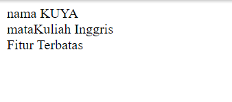

# PWEB2
### Pertemuan 1-2

## <center>JOBSHEET 1</center>
## #Instruksi Kerja
``` php
<?php
//menambahakan Atribut dan Metode
class Mahasiswa {
    public $nama;
    public $nim;
    public $jurusan;

    public function __construct($nama, $nim, $jurusan) {
        $this->nama = $nama;
        $this->nim = $nim;
        $this->jurusan = $jurusan;


    }

    public function tampilakanData() {
        return "Saya $this->nama, dengan $this->nim, dari $this->jurusan.";

    }


    public function updateJurusan($newJurusan) {
        $this->jurusan = $newJurusan;
    }

    public function setNim($newNim){
        $this->nim = $newNim;
    }


}
$mahasiswa1 = new mahasiswa("JosindoRaditAlbaran", "230302064", "TeknikInformatika");
echo $mahasiswa1->tampilakanData();
echo $mahasiswa1->updateJurusan("Mesin");
echo $mahasiswa1->tampilakanData();
echo $mahasiswa1->setNim("230302076");
echo $mahasiswa1->tampilakanData();
?>
```
## 1. Membuat Class Mahasiswa
Membuat class mahasiswa, memiliki atribut yang berisi Nama, NIM, Jurusan.

```php
//menambahakan Atribut dan Metode
class Mahasiswa {
    public $nama;
    public $nim;
    public $jurusan;
}
```
## 2. Penggunaan method constractor

Membuat Method constructor yang digunakan untuk menganalisis data atribut pada claas dosen.
```php
public function __construct($nama, $nim, $jurusan) {
        $this->nama = $nama;
        $this->nim = $nim;
        $this->jurusan = $jurusan;
}
```

## 3. Penggunaan method TampilData
Membuat Method tampilkanDosen yang digunakan untuk menampilkan Atribut atau isi Atribut pada class dosen.
```php
public function tampilakanData() {
        return "Saya $this->nama, dengan $this->nim, dari $this->jurusan.";
}
```
## 4. Penggunaan method updateJurusan

Mengubah value dari jurusan pada atrubut dalam class mahasiswa
```php
public function updateJurusan($newJurusan) {
        $this->jurusan = $newJurusan;
    }
```
## 5. penggunaan method setNim
digunakan untuk mwngisi nim pada atribut
```php
public function setNim($newNim){
        $this->nim = $newNim;
    }
```
## 6.  Menampilkan Informasi Mahasiswa
Method ini digunakan untuk menamplkan informasi mahasiswa.
```php
$mahasiswa1 = new mahasiswa("JosindoRaditAlbaran", "230302064", "TeknikInformatika");
echo $mahasiswa1->tampilakanData();
echo $mahasiswa1->updateJurusan("Mesin");
echo $mahasiswa1->tampilakanData();
echo $mahasiswa1->setNim("230302076");
echo $mahasiswa1->tampilakanData();

```

## Hasil Pembuatan Class mahasiswa


## #Pembuatan Class Dosen
```php
<?php
//menambah atribut dan metode
class Dosen {
    public $nama;
    public $nip;
    public $mataKuliah;

    public function __construct($nama, $nip, $mataKuliah) {
        $this->nama = $nama;
        $this->nip = $nip;
        $this->mataKuliah = $mataKuliah;
    }
    public function tampilkanDosen() {
        return "Dosen : $this->nama<br> Nip : $this->nip<br> mataKuliah : $this->mataKuliah.";

    }
}
 

$dosen1 = new Dosen("JosindoRaditAlbaran", "234563213", "Matamatika");
echo $dosen1->tampilkanDosen();
?>
```

## 1. Membuat Class Dosen
Membuat Class dosen, memiliki atribut yang berisi Nama, Nip, Mata Kuliah.

```php
class Dosen {
    public $nama;
    public $nip;
    public $mataKuliah;
}
```

## 2. Membuat Method Constructor
Membuat Method constructor yang digunakan untuk menganalisis data atribut pada claas dosen.

```php
//constructor
public function __construct($nama, $nip, $mataKuliah) {
        $this->nama = $nama;
        $this->nip = $nip;
        $this->mataKuliah = $mataKuliah;

}
```

## 3. Membuat Method TampilDosen
Membuat Method tampilkanDosen yang digunakan untuk menampilkan Atribut atau isi Atribut pada class dosen.

```php
//TampilDosen
public function tampilkanDosen() {
        return "Dosen : $this->nama<br> Nip : $this->nip<br> mataKuliah : $this->mataKuliah.";

    }
```

## 4.  Menampilkan Informasi Dosen
Method ini digunakan untuk menamplkan informasi dosen.

```php
//Menampilkan informasi dosen
$dosen1 = new Dosen("JosindoRaditAlbaran", "234563213", "Matamatika");
echo $dosen1->tampilkanDosen();
```

## Hasil Pembuatan Class dosen


### Pertemuan 3-4

## <center>JOBSHEET 2</center>
## #Instruksi Kerja
## 1. Membuat Class Mahasiswa
Membuat class mahasiswa, memiliki atribut yang berisi Nama, NIM, Jurusan.

```php
<?php
//menambahakan Atribut dan Metode
class Mahasiswa {
    private $nama;
    private $nim;
    private $jurusan;
    //construct
    public function __construct($nama, $nim, $jurusan) {
        $this->nama = $nama;
        $this->nim = $nim;
        $this->jurusan = $jurusan;


    }
    //tapilData
    public function tampilakanData() {
        return "Saya $this->nama<br> dengan $this->nim<br> dari $this->jurusan.";

    }
}
//menampilkan data
$mahasiswa1 = new mahasiswa("JosindoRaditAlbaran", "230302064", "TeknikInformatika");
echo $mahasiswa1->tampilakanData();

?>

```
## Output


## 2. Encapsulation
adalah cara “membungkus” data dan method yang menyusun kelas sehingga
kelas dapat dipandang sebagai suatu modul dan menyembunyikannya dari dunia
luar.
```php
<?php
//menambahakan Atribut dan Metode
class Mahasiswa {
    private $nama;
    private $nim;
    private $jurusan;
    //function construct
    public function __construct($nama, $nim, $jurusan) {
        $this->nama = $nama;
        $this->nim = $nim;
        $this->jurusan = $jurusan;


    }
    //function tampilData
    public function tampilakanData() {
        return "Saya $this->nama<br> dengan $this->nim<br> dari $this->jurusan.";

    }
    //setter
    public function setNama($newNama){
        $this->nama = $newNama;
    }
    //setter
    public function setNim($newNim){
        $this->nim = $newNim;
    }
    //setter
    public function setJurusan($newJurusan){
        $this->jurusan = $newJurusan;
    }
    //getter
    public function getNama(){
        echo "nama $this->nama<br>";
    }
    //getter
    public function getNim(){
        echo "Nim $this->nim<br>";
    }
    //getter
    public function getJurusan(){
        echo "Jurusan $this->jurusan<br>";
    }

}//menampilan data
$mahasiswa1 = new mahasiswa("", "", "");

$mahasiswa1->setNama ("Darno");
$mahasiswa1->setNim ("230302064");
$mahasiswa1->setJurusan ("Komputer dan Bisnis");

$mahasiswa1->getNama();
$mahasiswa1->getNim();
$mahasiswa1->getJurusan();
?>
```
## Output


## 3. Inheritance
adalah konsep dalam yang memungkinkan sifat dari
suatu class diturunkan kepada class lain.

```php
<?php
//membuat class dan objek
class Pengguna {
    public $nama;
    
    //function construct
    public function __construct($nama) {
        $this->nama = $nama;
    }

    //getter
    public function getNama(){
        echo "nama $this->nama<br>";
    }
} 

//membuat class turunan dari pengguna
class Dosen extends pengguna{
    public $mataKuliah;
    //function construct
    public function __construct($nama, $mataKuliah) {
        parent::__construct($nama);
        $this->mataKuliah = $mataKuliah;
    }
    //getter
    public function getmataKuliah(){
        echo "mataKuliah $this->mataKuliah<br>";

    }

}
//menampilkan data
$mahasiswa2 = new Dosen(nama : "KUYA", mataKuliah : "Inggris");
$mahasiswa2->getNama();
$mahasiswa2->getmataKuliah();

?>
```
## Output


## 4. Polymorphism
adalah konsep yang memungkinkan banyak class dengan fungsi berbeda untuk
mengeksekusi atau berbagi interface yang sama.

```php
<?php
//membuat class pengguna
    class pengguna {
    public $nama;
    
    //function construct
    public function __construct($nama) {
        $this->nama = $nama;
    }
    //gettter
    public function getNama(){
        echo "nama $this->nama<br>";
    }
} 
//membuat class turunan dari pengguna
class Dosen extends pengguna{
    public $mataKuliah;
    //function construct
    public function __construct($nama, $mataKuliah) {
        parent::__construct($nama);
        $this->mataKuliah = $mataKuliah;
    }
    //getter
    public function getmataKuliah(){
        echo "mataKuliah $this->mataKuliah<br>";

    }
    //function akses Fitur
    public function aksesFitur(){
        echo "Fitur  Terbatas";

    }

}
//menampilakan data
$mahasiswa2 = new Dosen(nama : "KUYA", mataKuliah : "Inggris");
$mahasiswa2->getNama();
$mahasiswa2->getmataKuliah();
$mahasiswa2->aksesFitur();

?>
```
## Output


## 5. Abstraction
Sebuah class yang tidak bisa digunakan untuk instansiasi 
(pembentukan) object.

```php
<?php
//membuat class pengguna
abstract class Pengguna{
    protected $nama;
    //function construct
    public function __construct($nama)
    {
        $this->nama = $nama;
    }
    //function askses Fitur
    abstract public function aksesFitur ();
}
//membuat class dari turunan pengguna
class Dosen extends Pengguna {
    private $matakuliah;
    //function construct
    public function __construct($nama,$matakuliah){
        parent:: __construct($nama);
        $this->matakuliah = $matakuliah;
    }
    //function akses Fitur
    public function aksesFitur() {
        return "Dosen " . $this->nama . " yang mengajar matakuliah " . $this->matakuliah . " memiliki akses untuk menginput nilai.";
    }

}
//membuat class dari turunan pengguna
class Mahasiswa extends Pengguna {
    private $nim;
    private $jurusan;

    public function __construct($nama,$nim,$jurusan){
        parent::__construct($nama);
        $this->nim = $nim;
        $this->jurusan =$jurusan;
    }
    //function akses fitur
    public function aksesFitur() {
        return "Mahasiswa bernama " . $this->nama . " dengan NIM " . $this->nim . ", jurusan " . $this->jurusan . " memiliki akses untuk melihat nilai.";
    }
    
}
//menampilkan data
$dosen1 = new Dosen ("darno", "Inggiris");
echo $dosen1->aksesFitur();
echo "<br>";

$mahasiswa1 = new Mahasiswa ("Baron", "230302044", "Komputer dan Bisnis");
echo $mahasiswa1->aksesFitur();
 ?>
```
## Output
